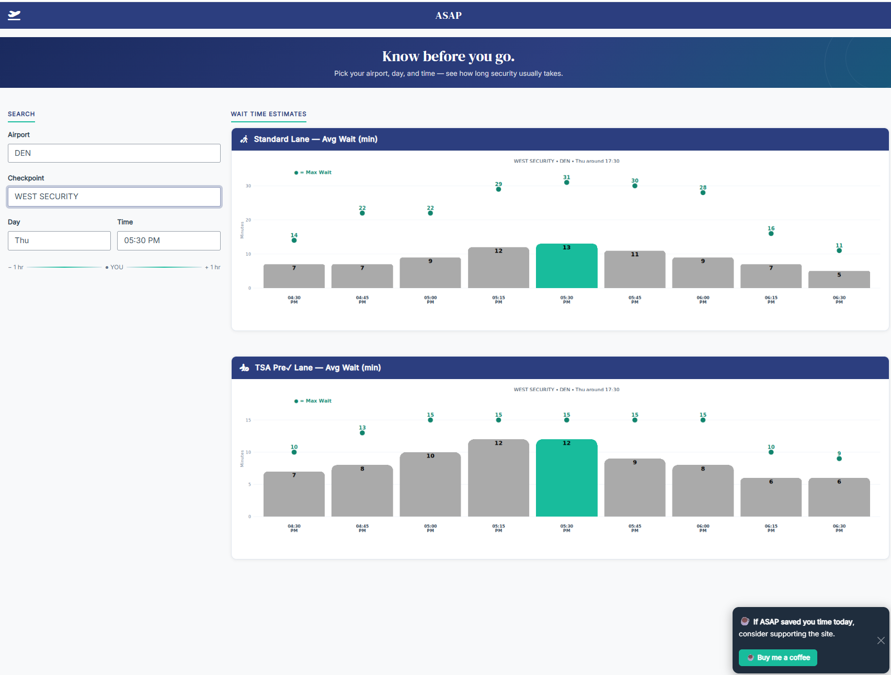
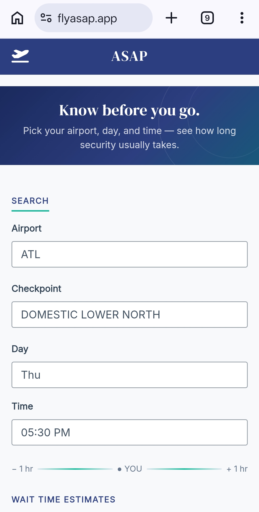
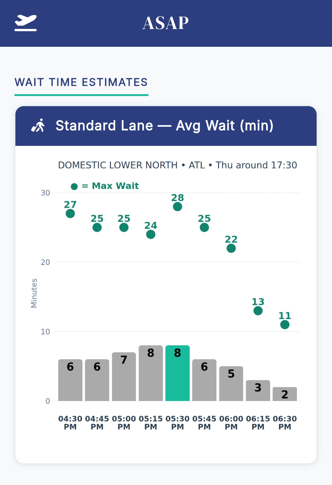

<p align="center">
  
</p>

<p align="center">
  <a href="https://www.r-project.org/"></a>
  <a href="https://shiny.posit.co/"></a>
  <a href="https://duckdb.org/"></a>
  
  
</p>

<h3 align="center">flyasap.app</h3>
<p align="center">Historical TSA checkpoint wait times for 22 US airports, rebuilt from a live feed scraped every 5 minutes.</p>

---

TSA's own app tells you the wait time right now. It won't tell you what 7:40am on a Tuesday usually looks like versus 7:40am on a Saturday. FlyASAP answers that second question — pick an airport, a checkpoint, a day of week, and a time window, and see the historical average and max wait pulled from real scraped data, not a schedule guess.

Built mobile-first because that's how almost everyone actually checks it — standing in the kitchen, bag half-packed, deciding whether to leave now.

## Screenshots

<p align="center">
  
</p>
<p align="center">
  
  &nbsp;&nbsp;
  
</p>

## Airports covered

22 airports, standard and TSA PreCheck lanes (CLEAR where the airport has it):

ATL · BOS · CLT · DCA · DEN · DFW · DTW · EWR · IAH · JFK · LAS · LAX¹ · LGA · MCO · MIA · MSP · PDX · PHL · PHX · SEA · SFO · SLC

¹ Temporarily down — the source site (`flylax.com/wait-times`) is currently returning an access-restricted response on its own end, not a scraper failure. Historical LAX data still shows; new data resumes once the page is republished.

More airports are in the pipeline.

## How it works

```
Raspberry Pi (every 5 min)          Nightly                          On request
─────────────────────────           ───────                          ───────────
22 airport scrapers  ──▶  DuckDB  ──▶  summary parquet  ──▶  S3  ──▶  EC2 pulls + restarts
(httr2 / JSON APIs,       (Quack        (day-of-week ×               Shiny Server
 a couple of chromote     protocol,      hour-of-day
 holdouts)                one writer)    buckets)
```

- **Scraping:** each airport has its own scraper under `02_Scripts/`, mostly hitting the airport's own JSON wait-time API directly via `httr2`; a few (ATL, EWR, JFK, LGA) go through a headless-Chrome batch job where no clean API exists.
- **Storage:** everything lands in DuckDB, written through a single persistent **Quack** server process so scrapers and interactive sessions can read/write concurrently without fighting DuckDB's exclusive file lock.
- **Serving:** a nightly job buckets the raw data into day-of-week / hour-of-day averages, ships it to S3 as parquet, and the production Shiny app (Ubuntu + nginx + Let's Encrypt on EC2) pulls the fresh file each morning.

## Tech stack

R · Shiny · DuckDB (Quack protocol) · ggplot2 · httr2 · chromote · Raspberry Pi (systemd timers) · AWS S3 · AWS EC2 · nginx

## Status

This is a working solo project, not a packaged product — there's no automated test suite yet (see badges above), and reliability work happens by watching production directly rather than CI. If you're poking around the code: scrapers are airport-by-airport under `02_Scripts/`, the app itself is a single `app.R` under `03_App/`.

## License

Personal project — no license file yet, so standard copyright applies (all rights reserved) until that's decided. Ask before reusing.
